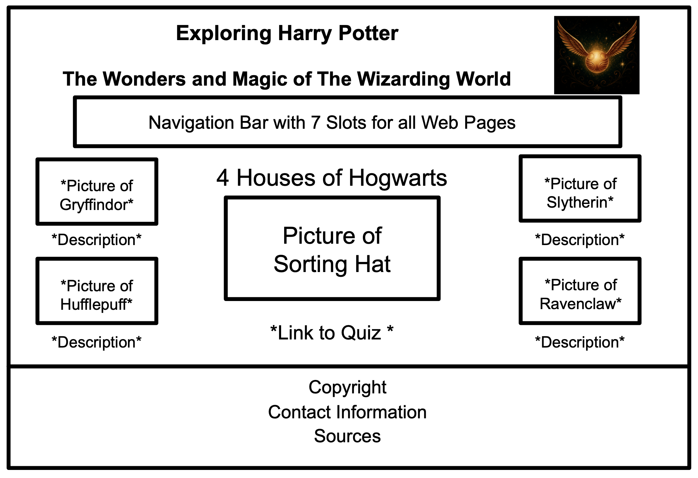

# Exploring Harry Potter  
### *The Wonders and Magic of The Wizarding World*  

---

## LOGO  
*()*  

---

## Description  
Welcome to the World of Harry Potter! Join us in learning about each main character, explore the wonderful school of Hogwarts, learn about different spells, and more. Here you’ll discover fascinating stories behind Harry, Hermione, Ron, and the many other unforgettable characters who shaped the wizarding world. You’ll also get to know the four Hogwarts houses, their founders, and what makes each of them unique. Dive into the enchanting lessons taught at Hogwarts, such as Defense against the Dark Arts, and unveil the mysteries behind some of the most powerful and unique spells. From patronuses to dementors, this website will take you on an enchanting journey through The Wizarding world of Harry Potter.  

---

## Outline of Website  

### Home Page  
The home page will contain a navigation bar that will allow the user to go to each webpage.  

### 1st Page – The Magic Begins  
This page will be exploring the history of how Harry Potter came to be. We will talk about the progress from being a book to a movie. It will also include short descriptions of the casting of characters and the settings of where main scenes were filmed. We will also be summarizing each book and movie of the Harry Potter series and connecting each movie to the next.  

### 2nd Page – Mysteries of the Hogwarts Houses  
In this page, we will be showing each of the 4 houses of Hogwarts and the unique characteristics of each group. There is also an optional quiz available that you can answer which will sort you into the house most suitable for you.  

### 3rd Page – Heroes of the Wizarding World  
In this page, we will be listing the main characters in the series and giving a short description of their role, background, age for each movie, and achievements.  

### 4th Page – Through the Halls of Hogwarts  
In this page, we will be exploring Hogwarts and will be noting some of the important places where notable events happened.  

### 5th Page – The Art of Wizardry  
In this page, we will be explaining and teaching you how to do simple spells that the characters often use. We will also be introducing you to their traditions and activities. There is also a short description of some magical creatures that can be found in the movies.  

### 6th Page – Meet the Minds Behind the Magic  
This page will contain a short introduction of the creators and all the sources we used for the project.  

---

## JS Incorporation  
JavaScript will be used in three major parts of the website to make it more interactive and engaging.  

First, the Hogwarts Castle Map in *Through the Halls of Hogwarts* will allow users to click on different areas of a realistic image of Hogwarts, such as the Great Hall or the Quidditch Pitch. When clicked, JavaScript will detect which part was selected, zoom in on that area, and display a pop-up with details or events related to that location.  

We will also use JavaScript for the Sorting Hat Quiz in *The 4 Houses of Hogwarts* to process user answers and determine their Hogwarts House, showing the result directly on the same page.  

These interactive elements, event detection, randomization, and logical decision-making cannot be accomplished with CSS only, making JavaScript important in bringing the magical world of Hogwarts to life on the website.  

## 🧙‍♂️ Wireframe Designs

Below are the wireframe designs used in creating the website:

### 🏠 Home Page

### 📖 The Magic Begins

### 🦁 Mysteries of the Hogwarts Houses

### 🧍‍♂️ Heroes of the Wizarding World

### 🏰 Through the Halls of Hogwarts

### ✨ The Art of Wizardry

### 🪄 Meet the Minds Behind the Magic

---

## HTML Form
Our website will include an HTML form where we can help the user choose their preferred Hogwarts House based on their traits or characteristics. Our form will collect some personal information to personalize their experience. The form will be asking for the user’s name and preferred Hogwarts House. There will also be a list of traits or values where they can select the ones that best describe their personality. We will include a list of traits per House so that they can confirm which group best suits them based on the traits that they have selected. The form will also be asking you to select classes which you are interested in so that it can make you a class schedule. The information from the form will be saved on the local storage of the user’s device. 

---

## Outline of HTML Form Pages

### 1st Page - HTML Form
This page will display the HTML form where the user will input their name, Hogwarts House preference, select the characteristics that best describe their personality, and choose the classes that seem the most interesting to them. This will then be saved on the local storage of their device. 

### 2nd Page
This page will be displaying the collected information from the form. It will display the characteristics you checked that connected you to this house. It will take into consideration your preferred group, however, it can also assign you to the House whose characteristics match better to your selected characteristics. The page will be designed based on the color schemes of your chosen House.

### 3rd Page
This page will be making a class schedule for you based on your preferred classes. If you are interested in Quidditch or any other extracurricular activities, it can also include practice sessions for your hobbies.

---

## Wireframe Designs

Below are the wireframe designs used in creating the HTML Form:

### HTML Form

### 2nd Page

### 3rd Page
